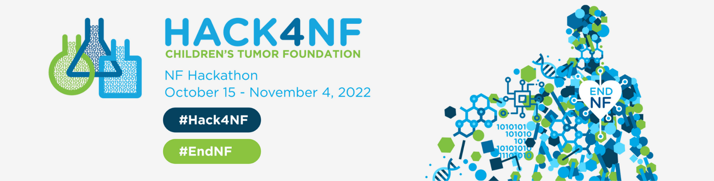
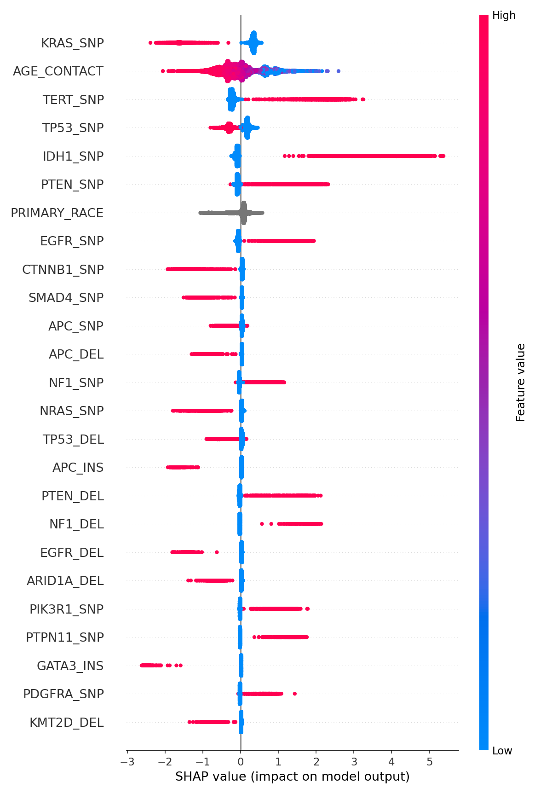
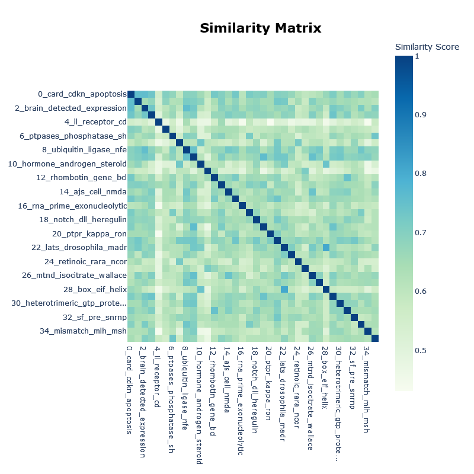
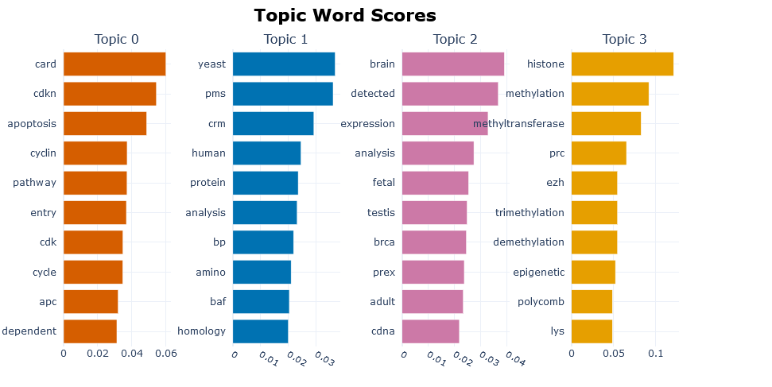
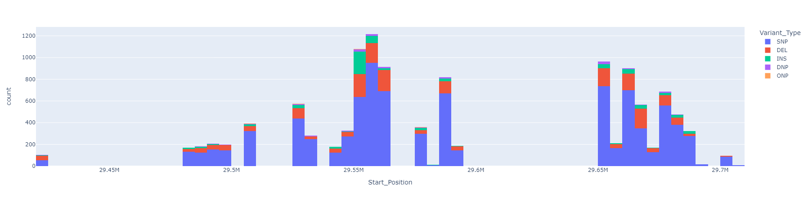

#[Hack4NF-2022](https://hack4nf-platform.bemyapp.com/#/event)

The Challenge 1 propose “Use Genomics Evidence Neoplasia Information Exchange (GENIE) datasets to develop a new 
framework that accurately uses genomic data to classify tumor samples for neurofibromatosis-related tumors.”

Our team has developed a solution based on Machine Learning (ML) and Natural Language Processing (NLP) techniques
* **[Online demo](https://pasturl-hack4nf-2022-app-o8lusi.streamlit.app/)**: It's an online application developed
  with [streamlit](https://streamlit.io/) that allow users interact with the trained ML model. The users can see
  the most relevant gene mutations to predict each type of cancer. Moreover, the most relevant genes are clustered 
  using [BERTopic](https://maartengr.github.io/BERTopic/index.html), an NLP model. 
* **[Project page](https://hack4nf-platform.bemyapp.com/#/projects/634fdae469c573321d684dcf)**: Project documentation and
  presentation in the Hack4NF website.

## Pipeline
1. **Download data**: Download genie data using synapse id to create structured csv files. To obtain gene info [marvel API](http://marrvel.org/) is used to download data from [OMIM](https://www.omim.org/)
2. **Create dataset**: Transform data to generate the dataset with all gene mutation features. The process is parametrized to work at both levels, patient, and sample.
3. **Supervised ML model**: Train a supervised ML model to predict each cancer type or genetic mutation using genomic features. LightGBM library from Microsoft is used to train the model.
4. **Model interpretability**: Use model explainability techniques (SHAP) to understand feature importance and its relation with the model prediction.
5. **NLP**: Get gene info from marrvel and apply BERTopic, to cluster genes based on the OMIM info.

The pipeline is parametrized in the config/resources.yaml file to allow easy experimentation. 
Some relevant parameters:
* **aggregation_level**: To define at which level train the model (patient or sample)
* **targets**: List of cancer_types and/or genes to be defined as targets for the model.
* **clinical_features**: List of clinical features to be used. In this case only age is used.
* **categorical_features**: Features to be used as categorical (i.e. race).
* **nlp_thresholds_importance**: Minimum SHAP importance value to use the gene in the NLP clustering step. 
  Higher values reduce the number of genes that are selected.   
* **bert_min_topic_size**: Represents the minimum number of genes of the created clusters. 
  Higher values reduce the number of clusters created.

### Dataset creation
The Genie raw data is processed to create the dataset with gene mutation features at two different levels:
* **Sample**: The same level at which the gene mutations are recorded in the data_mutation_extended file. In this dataset
  one patient could appear in several rows, one by sample. 
* **Patient**: In this case, the dataset is aggregated at the patient level. A patient only appear at one row, 
  and the mutation features are calculated considering all patient's samples.

The features of gene mutations are calculated considering which variant type is presented (i.e. NF1 DEL, 
NF1 SNP, NF1 INS). It was evaluated the possibility of use the start-end position of the mutation, but the data at this
level become too sparse. An alternative could be used the region of the gene (not the exact mutation position)
to exact position. The analysis could be seen on EDA_NF1_mutation_position notebook.

### ML model
The ML model is based On boosted decision tree algorithms. For the target definition, two approaches were implemented:
1. Use genetic mutations to predict the cancer (binary classification and multiclass).
2. Use genetic mutations to predict other mutations without using the target
   as feature. It could help to understand gene mutation correlation 
   with NF1, NF2, SMARCB1 and LZTR1. 

#### Glioma SHAP feature importance
The features are ranked by the SHAP importance value. The color represents the feature value, 
red means high value, and blue low values of the feature. The X-axis has represented the impact
on the model prediction. Some of the most important features:
* **KRAS_SNP**: High values (which means SNP mutation) represent a lower probability of  glioma cancer.
  This relation could not be check with any paper. In one research paper [by Guan, Qian, et al.](https://www.ncbi.nlm.nih.gov/pmc/articles/PMC8039792/),
  individuals with KRAS rs7312175 GA genotype were more likely to develop glioma.
  Further research should be done. 
* **TERT_SNP**: High values represent a higher probability of  glioma cancer.
  It is presented in [this paper by Mosrati, Mohamed Ali, et al.](https://www.ncbi.nlm.nih.gov/pmc/articles/PMC4599297/)
* **IDH1_SNP**: High values represent a higher probability of glioma cancer.
  It is in line with what has been published [by Yan, Hai, et al.](https://www.nejm.org/doi/full/10.1056/NEJMoa0808710)

### NLP 
The BERTopic model createS clusters of the most important genes using the OMIM info. The most relevant words for 
each cluster are presented and the relations between the clusters.

#### Relation between topics of most relevant genes for Glioma

#### Example of top words for 3 topics

### Notebooks
There are some notebooks with some analyzed and work in progress:
* ANN_model_multiclass: Baseline model with multiclass and multilabel target
* EDA_NF1_mutation_position: Exploratory Data Analysis (EDA) of the start-end position of NF1 mutation.
  The different regions where the mutations starts could be seen in this plot. This could be useful to 
  define more granular features, using the region where the mutations occur.
  
* EDA_umap_lgb_genie_NF1_related_cancer: Work done with the previous Genie dataset. 
  Some EDA, ML modelling, and unsupervised techniques have been used.
* NLP_NF1_lgb_prediction_relevant_features: Use of BERTopic with relevant features from the previous notebook.
* shap_importances_model_targets: Combine the relevant features for the different models.

# Next steps
* Refine which features are used
* Analyze which genes are evaluated in each study
* Evaluate how are handle multi samples from a patient
* Implement a multiclass model
* Develop an embedding of mutations to be used as pretrained model
* Improve text cleaning adding more stopwords
* Review most important genes from each cancer type
* Understand biological function of important genes
* Evaluate possible genetic drug targets based in the important genes

# References
* https://www.mskcc.org/cancer-care/types/neurofibromatosis/neurofibromatosis-type-1-nf1
* https://www.mayoclinic.org/es-es/diseases-conditions/neurofibromatosis/symptoms-causes/syc-20350490
* https://www.nhs.uk/conditions/neurofibromatosis-type-1/
* https://www.thieme-connect.com/products/ejournals/abstract/10.1055/s-0034-1382021
* https://pubmed.ncbi.nlm.nih.gov/25062113/
